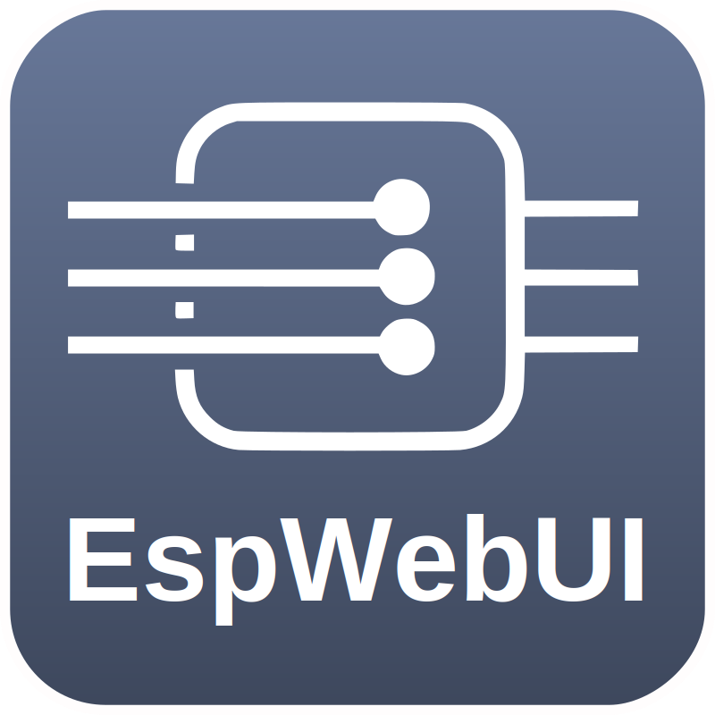

<div align="center">


<h3 style="text-align: center;">EspWebUI</h3>
</div>

-----


<div align="center">

[](https://github.com/dewenni/EspWebUI/releases/latest)


[](https://github.com/dewenni/EspWebUI/stargazers/)

</div>

-----

<div align="center">
If you like this project, feel free to push the <b>[Star ⭐️]</b> button and click <b>[Watch 👁]</b> to stay updated.
<br><br>
And if you'd like to support my work, you can also<p>

[](https://github.com/sponsors/dewenni)

</div>

-----

# ESP-WebUI

EspWebUI is a framework library to build flexible and powerfull webserver based on ESP

You can find the corresponding Template Project here: https://github.com/dewenni/EspWebUI-Template

## Installation

### Arduino IDE

1. Download the latest version of this library from [GitHub](https://github.com/dewenni/EspWebUI).
2. Extract the ZIP file into your Arduino `libraries` folder.
3. Restart the Arduino IDE.

### PlatformIO

1. Add the library to your `platformio.ini` file:

   ```ini
   lib_deps =
       https://github.com/dewenni/EspWebUI
